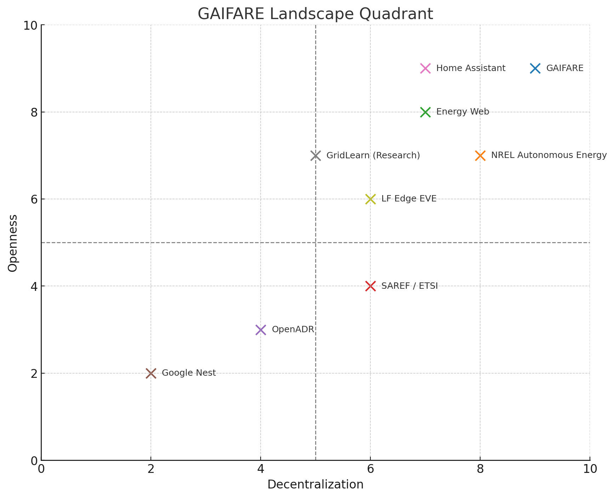

# GAIFARE Landscape Scan: Related Projects and Initiatives

This document provides a working overview of initiatives similar to **GAIFARE (Generative AI for Autonomous Renewable Energy)** for discussion and collaborative input. The goal is to identify overlaps, gaps, and collaboration opportunities as GAIFARE develops under LF Energy’s ORES working group.

---

## Current Initiatives with GAIFARE Alignment

| Project / Initiative | Focus Area | Relation to GAIFARE | Link |
|----------------------|------------|----------------------|------|
| **NREL Autonomous Energy Systems** | Federated learning and intelligent grid agents | Research on decentralized autonomy in energy systems | [https://www.nrel.gov/grid/autonomous-energy](https://www.nrel.gov/grid/autonomous-energy) |
| **Energy Web / EW-DOS** | Decentralized energy orchestration via blockchain | Decentralized coordination + identity layer | [https://www.energyweb.org/technology/](https://www.energyweb.org/technology/) |
| **SAREF / ETSI** | Semantic standards for smart appliances | Metadata for GAIFARE agents | [https://saref.etsi.org/](https://saref.etsi.org/) |
| **OpenADR 2.0 / 3.0** | Demand response signaling protocol | Grid–home interaction layer | [https://www.openadr.org/](https://www.openadr.org/) |
| **Google Nest Rush Hour Rewards** | Proprietary home DR optimization | Closed-source automated coordination | [https://nest.com/energy-partners/](https://nest.com/energy-partners/) |
| **Home Assistant / ESPHome** | Open smart home platform | Integration platform for GAIFARE agents | [https://www.home-assistant.io/](https://www.home-assistant.io/) |
| **GridLearn (Research)** | Multi-agent reinforcement learning for smart grid | Agent-based AI learning models | [https://arxiv.org/abs/2110.06396](https://arxiv.org/abs/2110.06396) |
| **LF Edge EVE** | Virtualization layer for edge compute | Deployment base for edge-hosted AI agents | [https://www.lfedge.org/projects/eve/](https://www.lfedge.org/projects/eve/) |

---

## Visual: Landscape Positioning

This quadrant chart visualizes the relative **openness** and **decentralization** of each initiative compared to GAIFARE's objectives.

---

## Gaps GAIFARE Intends to Fill

- Open source, LLM-compatible **energy agent framework**
- Designed for **home/microgrid-scale autonomy**
- Supports real-time **negotiation, scheduling, and reasoning**
- Integrates **forecasting + peer-to-peer coordination**
- Aligns with **cloud-native and software-defined energy systems**

---

## Call for Collaboration

This landscape is a **living document**. If you know of relevant projects or have suggestions, feel free to contribute via pull request or GitHub issue.
